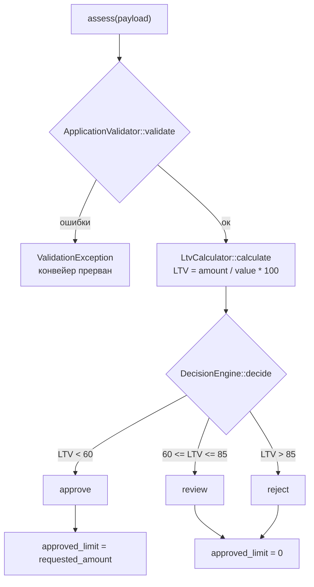

# Карта кода: как считается решение по заявке

Дата: 2026-10-06. Обзор `backend/src/Domain/` и `backend/config/rules.php`
(задача MILEAGE как контекст будущего изменения).

## Участники

| Файл | Роль |
|---|---|
| `backend/config/rules.php` | Справочник порогов: длины, лимиты, `ltv.approve_max` = 60.0, `ltv.review_max` = 85.0 |
| `AssessmentService.php` | Оркестратор: валидация → LTV → решение → ответ |
| `ApplicationValidator.php` | Проверка всех полей заявки по правилам из конфига, возвращает нормализованные данные |
| `VinValidator.php` | Формальная проверка VIN (длина 17, A–Z и 0–9, без I/O/Q) |
| `VehicleAge.php` | Возраст авто = `currentYear - productionYear` (по году, без месяца) |
| `LtvCalculator.php` | LTV = `requested_amount / market_value * 100`, округление до 2 знаков |
| `DecisionEngine.php` | Превращает LTV в строку `approve` / `review` / `reject` |
| `ValidationException.php` | Исключение с картой «поле → сообщение об ошибке» |

## Порядок вызовов

Всё начинается с `AssessmentService::assess(array $payload)` (строка 28):

1. **`ApplicationValidator::validate($payload)`** — нормализует и проверяет:
   - `vin` → `VinValidator::isValid()` (после `strtoupper(trim(...))`);
   - `year` → через `VehicleAge::inYears()`: год ≥ 1990, не в будущем, возраст ≤ 20 лет;
   - `mileage` — от 0 до 500 000 км (`vehicle.max_mileage_km`);
   - `market_value` — строго > 0;
   - `requested_amount` — от 50 000 до 2 000 000;
   - `term_months` — от 3 до 48.

   При ошибках бросается `ValidationException` — конвейер останавливается,
   решение не выносится. Иначе возвращается массив чистых данных.

2. **`LtvCalculator::calculate($input['requested_amount'], $input['market_value'])`** —
   оба аргумента положительны после валидации; результат — процент с двумя знаками.

3. **`DecisionEngine::decide($ltv)`** — сравнение с порогами из `rules['ltv']`
   (получены через конструктор):
   - `LTV < 60.0` → `approve`
   - `60.0 ≤ LTV ≤ 85.0` → `review`
   - `LTV > 85.0` → `reject`

4. **Ответ** в `assess()`: возраст авто, LTV, решение и `approved_limit` —
   запрошенная сумма при `approve`, иначе 0.



## Известные особенности кода

- **Расхождение комментария и кода.** Док-блок `DecisionEngine` (строки 10–12)
  и комментарий в `rules.php` (строки 39–41) описывают правило как
  `LTV <= approve_max → approve`, но в коде строгое неравенство
  (`if ($ltv < $this->approveMax)`): при LTV ровно 60.0 заявка получит `review`.
- **`ltv_by_age` пока не используется.** Справочник заполнен, но домен его не
  читает; лимит считается тривиально. Это отложенная задача LOAN-12.
- **`VehicleAge` используется дважды** — в валидаторе (проверка возраста)
  и в `assess()` (значение `vehicle_age` для ответа).
- Все пороги приходят из `rules.php` через конструкторы; бизнес-числа в
  доменных классах не хардкодены. Константы `APPROVE`/`REVIEW`/`REJECT` —
  имена решений, а не числа.

## Правило «пробег > 400 000 км → review»: точки вставки

Правило меняет вердикт, а не валидацию (заявка остаётся валидной), поэтому
в `ApplicationValidator` его ставить не надо — там нарушение означает
`ValidationException` и отказ обрабатывать заявку вовсе.

1. **`DecisionEngine::decide()` (строки 30–41)** — основная точка: второй
   параметр `int $mileage` и сравнение с порогом рядом с LTV-ветками.

   ```php
   30:     public function decide(float $ltv): string
   31:     {
   32:         if ($ltv < $this->approveMax) {
   ...
   ```

2. **`AssessmentService::assess()` (строки 30–35)** — проброс пробега в движок;
   `$input['mileage']` уже доступен с строки 30.

   ```php
   30:         $input = $this->validator->validate($payload);
   ...
   33:         $decision = $this->decisionEngine->decide($ltv);
   ```

3. **`rules.php`, блок `vehicle` (строки 20–24)** — новый порог для решения,
   условно `review_max_mileage_km => 400000`, рядом с `max_mileage_km`
   (границей валидации). Значение должно дойти до `DecisionEngine` через
   конструктор, где сейчас читаются только `ltv`-пороги.

   ```php
   20:     'vehicle' => [
   21:         'min_year' => 1990,
   22:         'max_age_years' => 20,
   23:         'max_mileage_km' => 500000,
   24:     ],
   ```

### Что уже есть для правила

- Валидированный `$input['mileage']` (int, гарантированно 0–500 000) доступен
  в `AssessmentService::assess()` в момент вызова `decide()`.
- Паттерн конфигурации: `DecisionEngine` уже получает пороги из `rules.php`
  через конструктор.

### Чего в коде нет (на момент обзора)

- Порога 400 000 в `rules.php` — нет.
- Приёма пробега в `DecisionEngine` — нет.
- Приоритета решений при конфликте (LTV говорит `reject`, пробег — `review`) —
  нет; это главный содержательный вопрос до вставки.
- Тестов на решение по пробегу — нет: `mileage` в тестах — только валидное поле
  в фикстурах (`ApplicationValidatorTest`, `AssessmentServiceTest`).

### Последствия

- Из-за существующей валидации правило реально сработает только в диапазоне
  **400 000 < пробег ≤ 500 000**: заявки с пробегом выше 500 000 падают в
  `ValidationException` и до решения не доходят.
- При `review` `approved_limit` = 0 — уже текущее поведение `AssessmentService`
  (строка 39).
